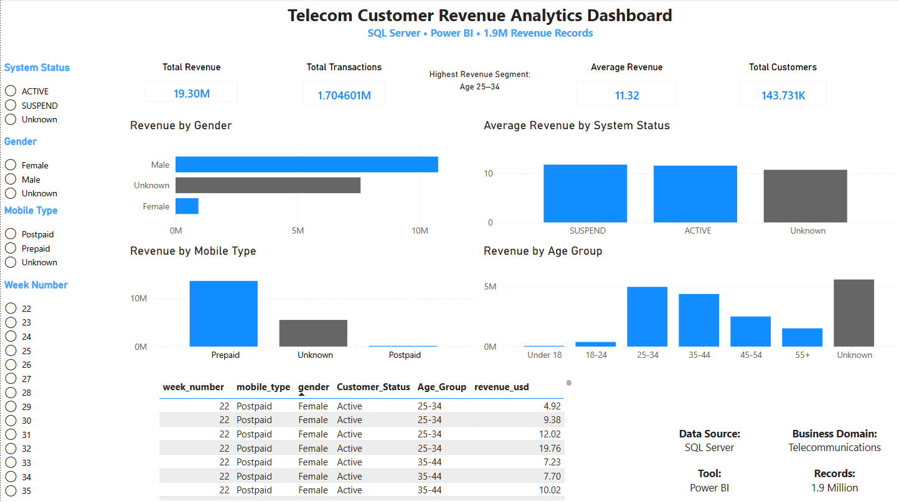
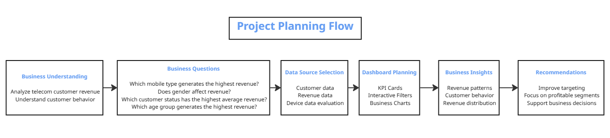

# Telecom Customer Revenue Analytics

### End-to-End Data Analytics Project using SQL Server & Power BI

> Transforming raw telecom customer and revenue data into business insights through data cleaning, SQL analytics, and interactive dashboards.

---

# Introduction

Telecommunication companies generate massive amounts of customer and revenue data every day. While this information has the potential to support better business decisions, raw datasets are rarely ready for analysis. They often contain duplicate records, inconsistent values, missing information, and other data quality issues that can affect the accuracy of any analytical results.

In this project, I built a complete end-to-end analytics workflow using **Microsoft SQL Server** and **Power BI**. Starting with raw telecom datasets, I cleaned and transformed the data, created an analytical data model, performed SQL-based exploratory analysis, and developed an interactive dashboard to answer practical business questions related to customer revenue.

Rather than focusing only on visualization, this project emphasizes the entire analytics process—from preparing reliable data to delivering meaningful insights that can support business decision-making.

---

# Table of Contents

- Project Overview
- Business Problem
- Project Objectives
- Dataset Information
- Project Workflow
- Data Import
- Data Validation
- Data Cleaning
- Data Transformation
- Data Modeling
- SQL Views
- Exploratory Data Analysis (EDA)
- Power BI Dashboard
- Key Insights
- Business Recommendations
- How to Run the Project
- Technologies Used
- Future Improvements
- Author

---

# Project Overview

This project started with a simple question:

**How can raw telecom data be transformed into meaningful business insights?**

The available data contained millions of customer and revenue records collected from different operational systems. Before any analysis could begin, the data needed significant preparation. Duplicate customer records, inconsistent gender values, invalid birth years, and missing information all had to be addressed to ensure reliable results.

Using SQL Server, I built a complete data preparation pipeline that included importing the raw datasets, validating their quality, cleaning inconsistent records, transforming business attributes, and creating a reporting-ready analytical dataset.

Once the data was prepared, SQL was used to perform exploratory data analysis (EDA) and answer key business questions related to customer revenue and behavior.

The final stage was developing an interactive Power BI dashboard that allows users to explore revenue trends, compare customer segments, and monitor business performance through dynamic visualizations.

Although the dashboard is the final deliverable, most of the work in this project happened before Power BI was even opened. Building a reliable analytical dataset was the foundation for producing accurate insights.

---

# Business Problem

Telecommunication companies collect huge amounts of operational data every week, but raw data alone has very little business value. Decision-makers need clean, organized, and trustworthy information before they can answer even simple questions such as:

- Which customers generate the highest revenue?
- Does customer demographic information affect revenue?
- Which customer segments should receive more business attention?

The original datasets were not suitable for direct analysis. They contained duplicate customer records, inconsistent categorical values, missing demographic information, and invalid data that could easily lead to misleading conclusions.

The goal of this project was not simply to build a dashboard, but to create a reliable analytical dataset that could support business decisions with confidence.

---

# Project Objectives

The project was designed around a practical end-to-end analytics workflow rather than focusing only on visualization.

The main objectives were to:

- Import large telecom datasets into SQL Server.
- Validate data quality before analysis.
- Clean and standardize inconsistent records.
- Transform raw data into business-ready information.
- Build an analytical dataset optimized for reporting.
- Explore customer revenue using SQL.
- Develop an interactive Power BI dashboard.
- Answer real business questions using data instead of assumptions.

## Dataset

This project is based on a public telecommunications dataset available on Kaggle.

The dataset contains customer information, weekly revenue records, and device details collected from different operational sources. Together, these tables represent a realistic business scenario where data is distributed across multiple entities rather than stored in a single analytical table.

Instead of importing the data directly into Power BI, the entire preparation process was completed in SQL Server first. This made it possible to validate the data, clean inconsistent records, resolve duplicate customers, and build a reporting-ready dataset before moving to the visualization stage.

Dataset summary

| Item | Description |
|------|-------------|
| Industry | Telecommunications |
| Source | Kaggle |
| License | Public Domain |
| Database | Microsoft SQL Server |
| Visualization | Microsoft Power BI |
| Customer Records | ~13 Million |
| Revenue Records | ~1.9 Million |
| Device Records | ~2 Million |
| Revenue Period | Weekly |
| Currency | USD |

The original dataset is available here:

**Kaggle Dataset**

[(Link)](https://www.kaggle.com/datasets/krishnacheedella/telecom-iot-crm-dataset)

---

# Project Planning Flow

Before writing SQL queries or designing the dashboard, I first approached the project from a business perspective.

The process started by understanding the business domain and identifying the key questions that decision-makers would want answered. Based on these questions, I determined which datasets were required, planned the dashboard layout, and defined the visualizations needed to communicate the results effectively.

Only after completing this planning stage did the technical implementation begin.

The complete planning process is illustrated below.

This business-first approach helped ensure that every SQL query, transformation, and visualization was aligned with a clear business objective rather than being created simply because the data was available.

---

## Project Workflow

Before building the dashboard, the data went through a complete preparation pipeline inside SQL Server. The goal was to make sure every visualization was based on clean, validated, and business-ready data rather than raw operational records.

The workflow followed in this project is illustrated below.

.png)

Each stage builds on the previous one. Instead of fixing issues inside Power BI, all data preparation was completed in SQL Server first. This approach keeps the reporting layer simple, improves performance, and makes the analytical results easier to trust.

---

## Data Import

The project started by importing the raw telecom datasets into Microsoft SQL Server.

Three separate tables were loaded into the database:

| Table | Description |
|--------|-------------|
| Customers | Customer demographic and subscription information |
| Revenue | Weekly customer revenue transactions |
| Devices | Mobile device information |

The import process included:

- Creating the project database.
- Creating the required tables.
- Importing the raw files using **BULK INSERT**.
- Verifying that every dataset was imported successfully before starting any analysis.

Keeping the original data unchanged made it possible to repeat the cleaning process whenever needed without affecting the source data.

---

## Data Validation

Before making any modifications, the raw datasets were profiled to understand their overall quality.

The validation process focused on:

- Total number of records.
- Missing values.
- Duplicate records.
- Data type consistency.
- Category distributions.
- Revenue statistics.
- Year of birth validation.

This step helped identify several issues that needed to be addressed before moving to the analysis phase, including duplicate customer records, inconsistent gender values, and invalid birth years.

Instead of assuming the data was ready for reporting, every major column was validated first to reduce the risk of producing misleading business insights.

---

# Data Cleaning

Once the validation phase was complete, the next step was improving the overall quality of the data.

Rather than making changes to the original datasets, all cleaning operations were performed on working copies. This preserved the raw data while allowing the cleaning process to be repeated whenever necessary.

Several issues were identified and resolved during this stage, including:

- Standardizing inconsistent gender values into **Male**, **Female**, and **Unknown**.
- Replacing missing gender values with **Unknown**.
- Correcting customer status values to maintain consistency.
- Removing unrealistic birth years by replacing invalid values with NULL.
- Creating customer age from the year of birth.
- Categorizing customers into business-friendly age groups.
- Creating a simplified customer status field for reporting.
- Resolving duplicate customer records by creating a single clean customer profile for each MSISDN.

By the end of this phase, the customer data was significantly more consistent and suitable for business analysis.

---

# Data Transformation

After cleaning the data, several transformations were applied to make the dataset easier to analyze.

New business attributes were created directly inside SQL Server to simplify reporting and reduce calculations inside Power BI.

The transformation process included:

- Creating the **Age** column from the customer's birth year.
- Building **Age Group** categories for customer segmentation.
- Creating a simplified **Customer Status** field.
- Aggregating duplicate customer records into a single clean customer table.
- Joining customer information with weekly revenue records.
- Building a final reporting-ready analytical table.

These transformations converted operational data into a structure designed specifically for business reporting.

---

# Data Modeling

The original telecom data was distributed across multiple tables, each representing a different business entity.

Instead of importing every table directly into Power BI, a simplified analytical model was created inside SQL Server.

The final reporting table was built by joining weekly revenue records with the cleaned customer information using **MSISDN** as the primary key.

The device dataset was intentionally excluded from the analytical model because it was not required to answer the business questions defined at the beginning of the project.

This decision reduced unnecessary complexity while keeping the analysis focused on customer revenue and behavior.

---

# SQL Views

To separate data preparation from reporting, a SQL View was created on top of the final analytical table.

The view contains only the columns required for business reporting, making it easier to connect Power BI without exposing intermediate tables or cleaning logic.

Using a SQL View also improves maintainability. Any future changes to the data preparation process can be handled inside SQL Server without requiring major modifications to the Power BI report.

The Power BI dashboard connects directly to this reporting view rather than the raw tables.

---

# Exploratory Data Analysis (EDA)

After preparing the analytical dataset, SQL was used to explore customer revenue patterns and answer the business questions defined during the planning phase.

The analysis focused on customer behavior, revenue distribution, and customer segmentation rather than simply calculating descriptive statistics.

The following business questions were investigated:

- Which mobile type generates the highest revenue?
- Does gender influence customer revenue?
- Which customer status generates the highest average revenue?
- Which age groups contribute the most revenue?

To answer these questions, SQL aggregation functions such as **SUM()**, **AVG()**, **COUNT()**, together with **GROUP BY**, filtering, and joins were used throughout the analysis.

The SQL analysis also served as a validation step before building the Power BI dashboard, ensuring that the reported metrics matched the underlying data.

---

# Power BI Dashboard

After completing the SQL analysis, the reporting dataset was imported into Power BI to create an interactive business dashboard.

The dashboard was designed to provide decision-makers with a clear overview of customer revenue while allowing them to explore the data through interactive filters.

The report includes:

- KPI Cards
  - Total Revenue
  - Total Transactions
  - Average Revenue
  - Total Customers

- Interactive Slicers
  - Customer Status
  - Gender
  - Mobile Type
  - Week Number

- Business Visualizations
  - Revenue by Mobile Type
  - Revenue by Gender
  - Average Revenue by Customer Status
  - Revenue by Age Group

- Detailed Data Table
  - Weekly revenue records with customer segmentation details

The dashboard enables users to quickly compare customer segments, monitor revenue distribution, and interactively filter the results without writing additional SQL queries.

---

# Business Insights

The analysis revealed several useful business observations:

- Prepaid customers generated the highest share of total revenue.
- Revenue distribution varied across different customer age groups, with customers aged **25–34** contributing the largest portion of revenue among known age categories.
- Male customers generated higher total revenue than female customers, although a considerable number of records contained unknown gender information.
- Average customer revenue remained relatively consistent across different customer status groups.
- Customer demographic information can provide valuable segmentation insights when combined with revenue data.

These findings can help business teams identify profitable customer segments and support future marketing and retention strategies.

---

# Business Recommendations

Based on the dashboard findings, business teams can:

- Identify the customer segments generating the highest revenue.
- Compare prepaid and postpaid customer performance.
- Monitor revenue trends across different customer groups.
- Support marketing and customer retention decisions using interactive analysis.
- Investigate demographic segments with lower revenue performance.

---

# How to Run the Project

1. Download or clone this repository.
2. Import the original dataset into Microsoft SQL Server.
3. Execute the SQL scripts in the following order:
   - Bulk Create Table
   - Bulk Insert
   - Import Validation
   - Data Preparation
   - Views
   - EDA
4. Open the Power BI report (.pbix).
5. Refresh the data connection.
6. Explore the dashboard using the available slicers and visualizations.

---

# Technologies Used

| Tool | Purpose |
|------|---------|
| Microsoft SQL Server | Data import, cleaning, transformation, and analysis |
| T-SQL | Data preparation and exploratory analysis |
| Power BI | Interactive dashboard development |
| Miro | Workflow design |
| Kaggle | Dataset source |
| Git & GitHub | Version control and project hosting |

---

# Future Improvements

Possible future enhancements include:

- Integrating additional telecom KPIs.
- Performing customer segmentation using clustering techniques.
- Building predictive revenue forecasting models.
- Automating the data pipeline.
- Publishing the dashboard through Power BI Service.

---

## Author
**Khaled Taha Fahmy**
 *Data Analyst & AI Automation Engineer*
### Contact 
- LinkedIn: **
- GitHub: **
- Portfolio: **
- Email: **

